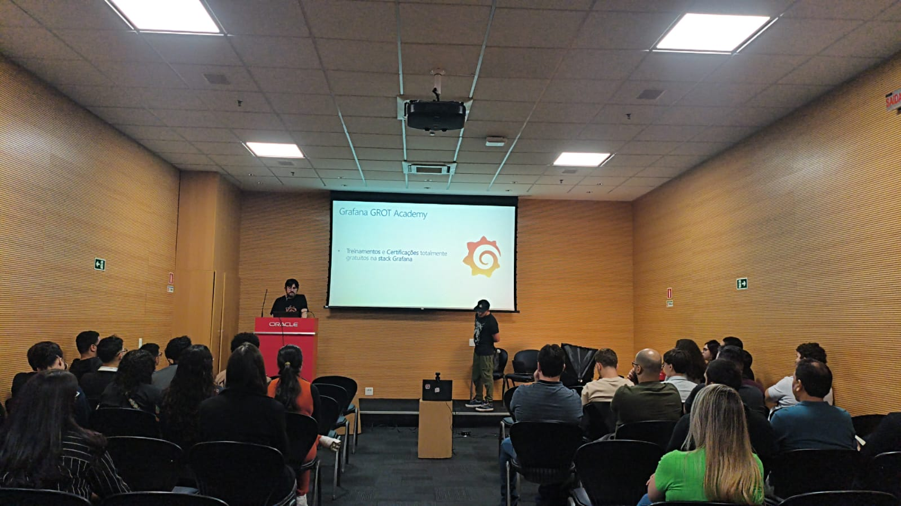
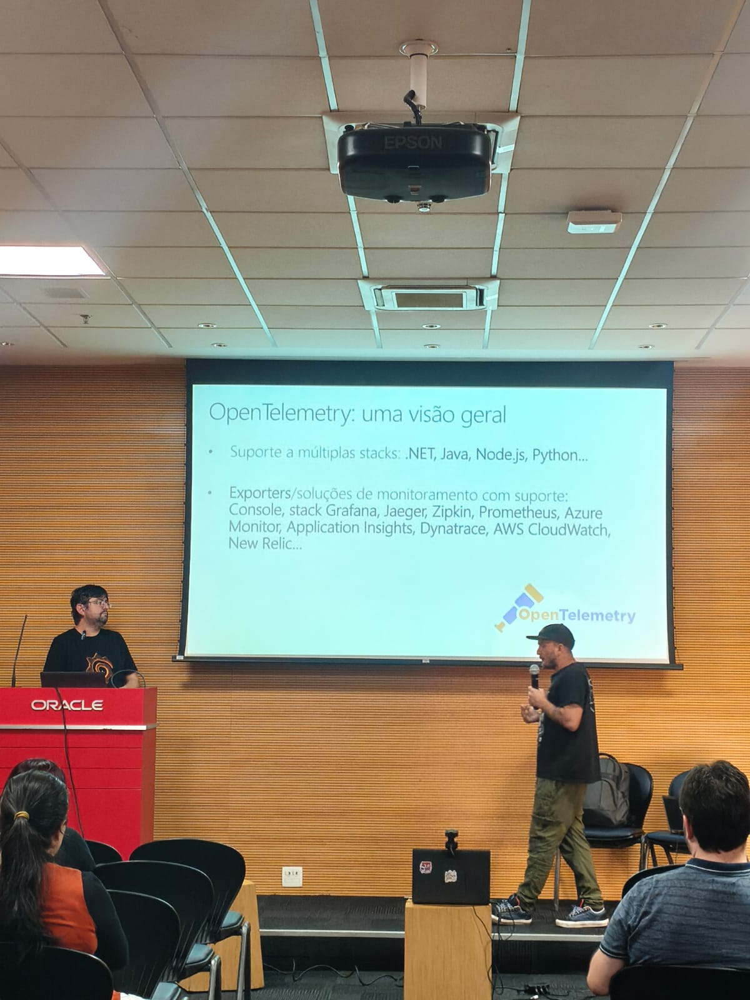
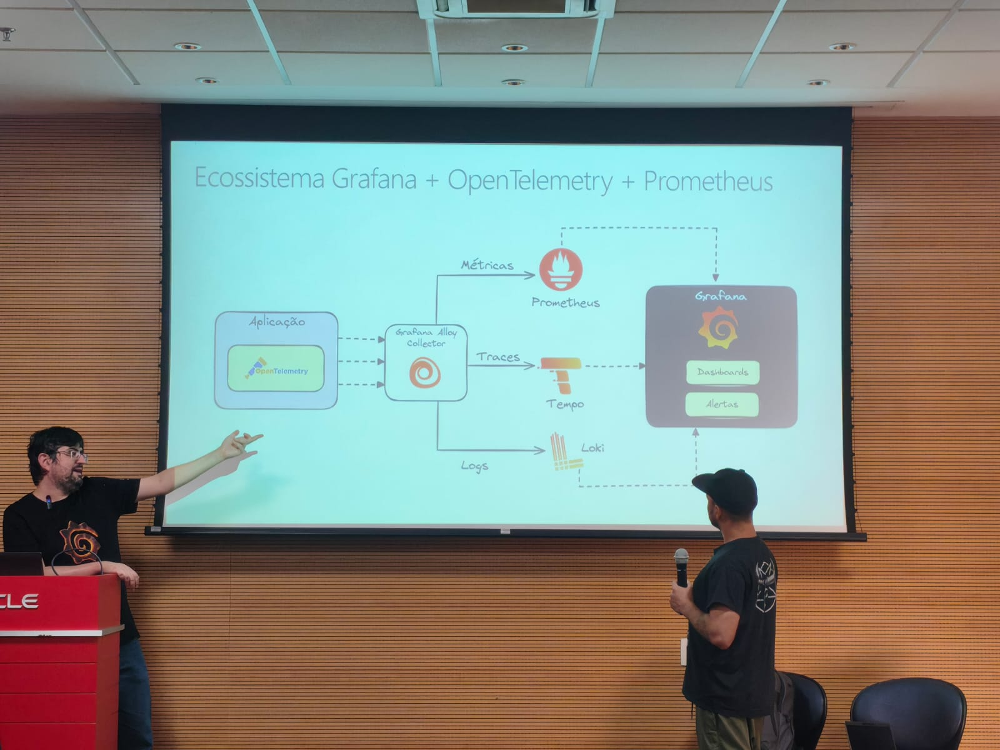
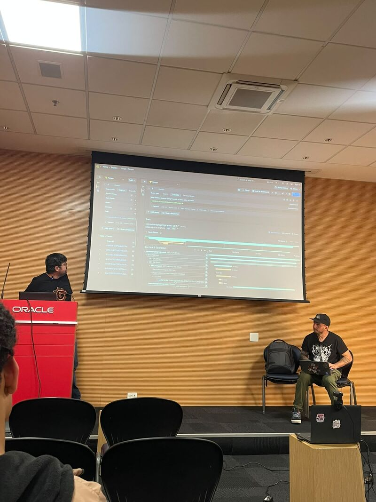
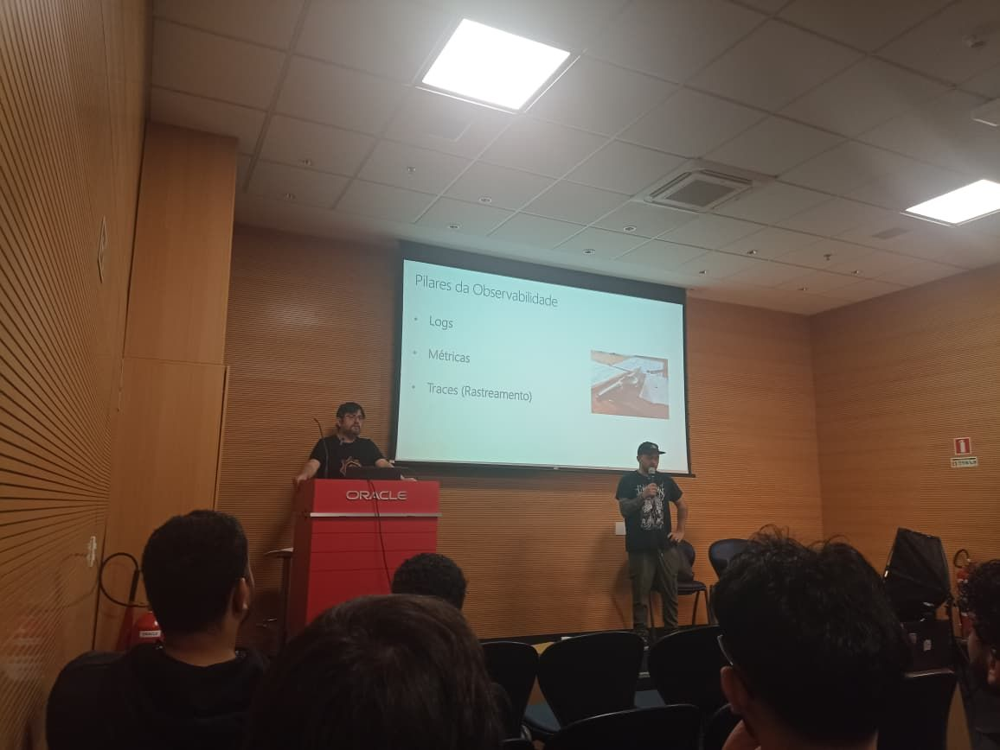
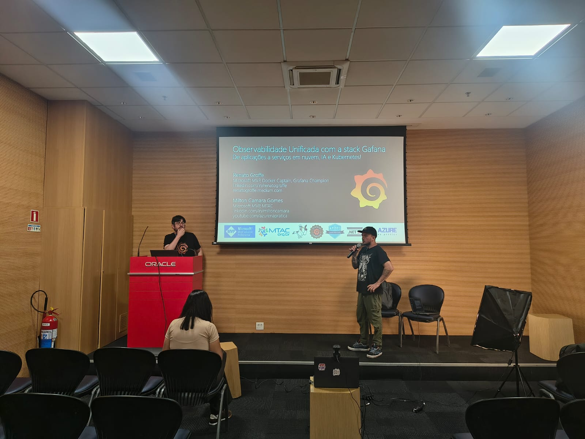
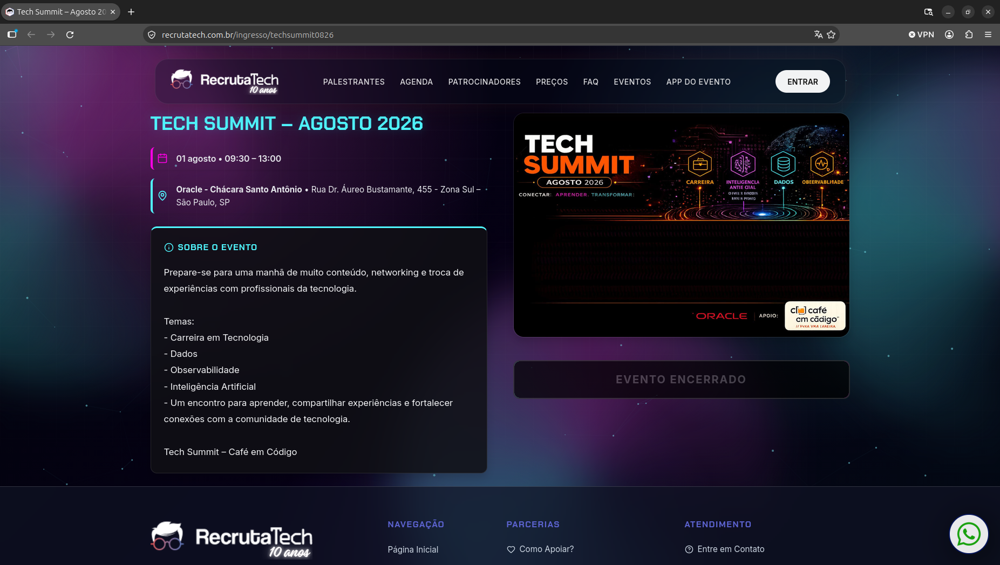

# observabilidade-stack-grafana_tech-summit-2026-08
Conteúdos da apresentação "Observabilidade Unificada com a stack Gafana: de aplicações a serviços em nuvem, IA e Kubernetes!". Palestra realizada no dia 01/08/2026, durante a edição de Agosto do Tech Summit em São Paulo-SP.

Exemplos utilizados:
- [**.NET 10 + ASP.NET Core + Oracle + Grafana + Tempo + Loki + Prometheus**](https://github.com/renatogroffe/aspnetcore10-opentelemetry-grafana-tempo-loki-prometheus-oracle-testcontainers_contagemacessos)
- [**Java + Springboot + Apache Camel + Grafana + Tempo**](https://github.com/renatogroffe/java-spring-camel_apiconsumobackend)
- [**APISIX + OpenBao (HashiCorp Vault) + Grafana + Prometheus**](https://github.com/renatogroffe/apisix-ai-gateway-microsoftfoundry-vault-otel-grafana-prometheus-dockercompose)

Dashboards para Kubernetes utilizando métricas do Prometheus: **https://github.com/dotdc/grafana-dashboards-kubernetes**

---

## Informações sobre o evento

Título da apresentação: **Observabilidade Unificada com a stack Gafana: de aplicações a serviços em nuvem, IA e Kubernetes!**

Evento: **Tech Summit Agosto 2026**

Data: **01/08/2026 (sábado)**

Tecnologias e tópicos abordados: **Grafana, OpenTelemetry, Tempo, Loki, Alloy, Prometheus, Containers, Docker, Docker Compose, Microsoft Azure, Azure Managed Grafana, .NET 10, ASP.NET Core, Oracle, Java, Springboot, Apache Camel, APISIX, OpenBao (HashiCorp Vault), Kubernetes, REST APIs, AI Gateways...**

Número de participantes: **39 pessoas**

Link do evento (inscrições): [**RecrutaTech**](https://recrutatech.com.br/ingresso/techsummit0826)

Local: **Oracle - Rua Dr. Áureo Bustamante, 455 - Chácara Santo Antônio - São Paulo - CEP: 04710-090**

Acesse este [**link**](/img/) para visualizar todas as fotos da apresentação.

Esta palestra foi realizada em conjunto com meu amigo **Milton Camara (Microsoft MVP)**.

Deixo aqui meus agradecimentos à **Cilene Danta** por todo o apoio para que participássemos como palestrantes desta edição do **Tech Summit**.

---

